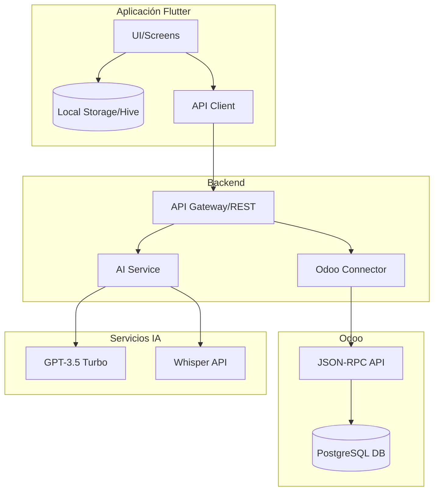
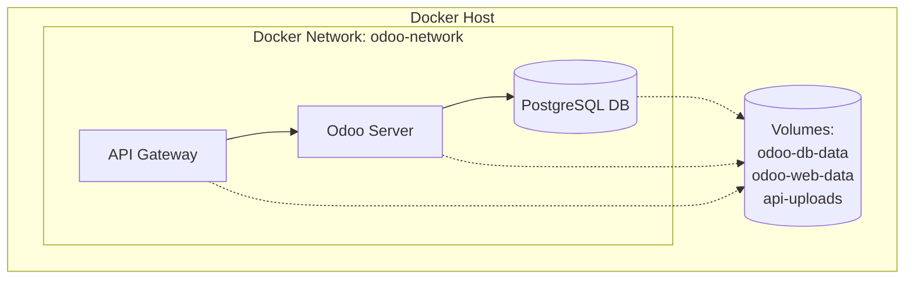
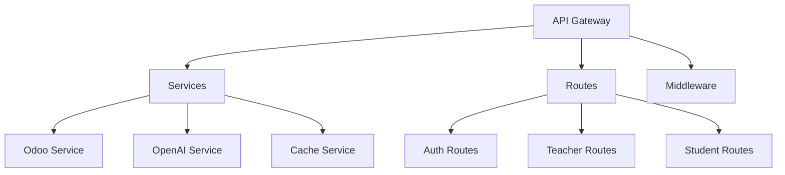
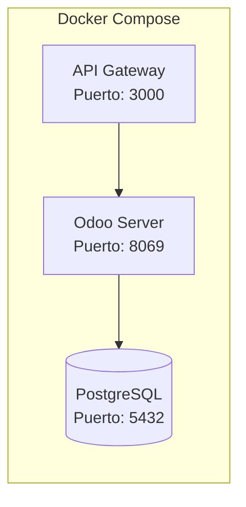

# Odoo Mobile Gateway API

API Gateway para la integración entre una aplicación móvil y un módulo de agenda electrónica escolar en Odoo. Esta API proporciona endpoints para gestionar alumnos, profesores, cursos, notificaciones y más.

## 📋 Tabla de Contenidos

- [Arquitectura](#arquitectura)
- [Requisitos](#requisitos)
- [Instalación](#instalación)
- [Configuración](#configuración)
- [Estructura del Proyecto](#estructura-del-proyecto)
- [Endpoints Disponibles](#endpoints-disponibles)
- [Uso](#uso)
- [Ejemplos](#ejemplos)
- [Consideraciones de Seguridad](#consideraciones-de-seguridad)

### 💬 Otros temas a profundizar

- [**Dockerización**](/docs/Dockerizacion.md) -> Dockerfile, docker-compose y otras excentricidades.
- [**Redes Docker**](/docs/Tipos-de-Redes-en-Docker.md) -> Tipos de redes en Docker.
- [**Volumenes Docker**](/docs/Tipos-de-Volumenes-en-Docker.md) -> Tipos de Volumenes en Docker.
- [**Imagenes Docker**](/docs/Creación-y-Gestión-de-Imágenes-Docker.md) -> Creación y Gestión de Imágenes Docker.


## 💻 Arquitectura





## 🌐 Estructura del Proyecto



## 🐳 Contenedores y Servicios



## 📝 Componentes del Sistema

La aplicación está compuesta por tres contenedores Docker principales:

1. **API Gateway (Node.js)**
   - Maneja peticiones de la app móvil
   - Gestiona autenticación
   - Procesa archivos y media
   - Puerto: 3000

2. **Odoo Server**
   - Core del sistema
   - Módulos personalizados
   - Puerto: 8069

3. **PostgreSQL Database**
   - Almacenamiento persistente
   - Puerto: 5432

## 🔧 Requisitos

- Node.js (v16 o superior)
- npm (v8 o superior)
- Instancia de Odoo ejecutándose con el módulo de agenda electrónica instalado
- Base de datos PostgreSQL (la que usa Odoo)

## 🚀 Instalación

1. Clonar el repositorio:
```bash
git clone <url-del-repositorio>
cd odoo-mobile-gateway
```

2. Instalar dependencias:
```bash
npm install
```

3. Crear archivo de variables de entorno:
```bash
cp .env.example .env
```

4. Configurar variables de entorno en el archivo `.env`:
```env
PORT=3000
ODOO_URL=http://localhost:8069
ODOO_DB=nombre_base_de_datos
JWT_SECRET=tu_secreto_jwt
```

## ⚙️ Configuración

### Variables de Entorno

| Variable | Descripción | Valor por defecto |
|----------|-------------|-------------------|
| PORT | Puerto donde correrá la API | 3000 |
| ODOO_URL | URL de tu instancia Odoo | http://localhost:8069 |
| ODOO_DB | Nombre de la base de datos Odoo | - |
| JWT_SECRET | Secreto para generar tokens JWT | - |

## 📁 Estructura del Proyecto

```
odoo-mobile-gateway/
├── src/
│ ├── config/
│ │   └── config.js
│ ├── middleware/
│ │   ├── auth.js
│ │   └── syncMiddleware.js
│ ├── model/
│ │   └── (modelos de la DB - modulo agenda - odoo)
│ ├── routes/
│ │   ├── auth.routes.js
│ │   ├── monitor.routes.js
│ │   ├── notification.enhanced.routes.js
│ │   ├── sync.routes.js
│ │   ├── teacher.ai.routes.js
│ │   └── teacher.enhanced.routes.js
│ ├── services/
│ │   ├── cacheService.js
│ │   └── conflictService.js
│ │   ├── odooService.js
│ │   ├── openaiService.js
│ │   └── syncService.js
│ └── index.js
├── uploads/
├── .env
├── .gitignore
├── documentacion-rutas.md
├── example.env
├── package.json
├── postman-notificaciones.json
├── postman-pruebas.json
└── README.md
```

## 🛣️ Endpoints Disponibles

### Autenticación
- `POST /api/auth/login` - Iniciar sesión

### Alumnos
- `GET /api/alumnos` - Obtener todos los alumnos
- `POST /api/alumnos` - Crear nuevo alumno
- `GET /api/alumnos/:id` - Obtener alumno específico
- `PUT /api/alumnos/:id` - Actualizar alumno
- `DELETE /api/alumnos/:id` - Eliminar alumno

### Notificaciones Mejoradas
- `GET /api/enhanced-notifications/my-notifications` - Obtener notificaciones según rol
- `POST /api/enhanced-notifications/mark-notification` - Marcar notificación como leída/recibida

[Ver documentación completa de endpoints](./ENDPOINTS.md)

## 🚦 Uso

1. Iniciar el servidor en modo desarrollo:
```bash
npm run dev
```

2. Iniciar el servidor en producción:
```bash
npm start
```

## 📝 [Ejemplos](/documentacion-rutas.md)

### Autenticación
```javascript
// Ejemplo de solicitud de login
fetch('http://localhost:3000/api/auth/login', {
  method: 'POST',
  headers: {
    'Content-Type': 'application/json'
  },
  body: JSON.stringify({
    username: 'usuario',
    password: 'contraseña'
  })
})
```

### Obtener Notificaciones (Como Tutor)
```javascript
fetch('http://localhost:3000/api/enhanced-notifications/my-notifications', {
  method: 'GET',
  headers: {
    'Authorization': 'Bearer tu_token'
  }
})
```

## 🔐 Consideraciones de Seguridad

1. **Autenticación**:
   - Todas las rutas (excepto login) requieren token JWT
   - Los tokens expiran después de 24 horas
   - Se utiliza HTTPS en producción

2. **Validación**:
   - Validación de datos en todas las entradas
   - Sanitización de parámetros de consulta
   - Verificación de permisos basada en roles

3. **Mejores Prácticas**:
   - Rate limiting implementado
   - Headers de seguridad configurados
   - Logs de acceso y errores

## 🤝 Contribuir

1. Fork el proyecto
2. Crear rama para feature (`git checkout -b feature/AmazingFeature`)
3. Commit cambios (`git commit -m 'Add some AmazingFeature'`)
4. Push a la rama (`git push origin feature/AmazingFeature`)
5. Abrir Pull Request

## 🐛 Reporte de Bugs

Si encuentras un bug, por favor abre un issue con:
- Descripción del problema
- Pasos para reproducirlo
- Comportamiento esperado
- Screenshots (si aplica)

## 📜 Licencia

Este proyecto está bajo la Licencia ISC - ver el archivo [LICENSE.md](LICENSE.md) para detalles

## ✍️ Autores

- **Diego** - *Trabajo Inicial - Modulo Odoo* - [DAVV422/odoo-sw1](https://github.com/DAVV422)
- **Kevin** - *Odoo Mobile Gateway API* - [runinbk/API-APP-Odoo](https://github.com/runinbk/API-APP-Odoo)
- **Heidy** - *App mobile - cliene Odoo* - [HeidyOlmosCampos/Odoo-movil](https://github.com/HeidyOlmosCampos/2do-examen-sw1-movil)

## 🎁 Agradecimientos

- Equipo de desarrollo del módulo Odoo
- Contribuidores
- etc

---
⌨️ con ❤️