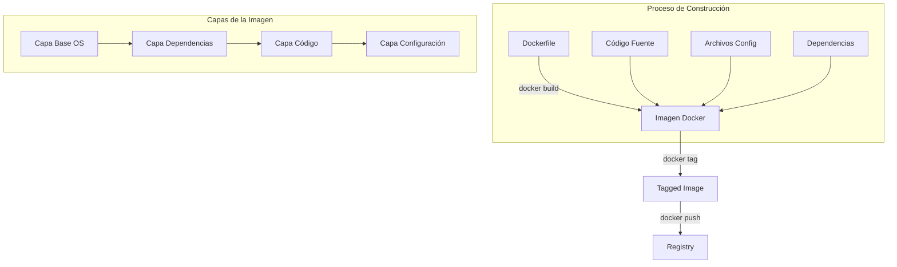

# 1. Creación y Gestión de Imágenes Docker



## A. Anatomía de un Dockerfile

```dockerfile
# Ejemplo de Dockerfile completo y explicado
# =========================================

# 1. Imagen Base
FROM node:18-alpine AS builder

# 2. Metadatos
LABEL maintainer="developer@company.com"
LABEL version="1.0.0"
LABEL description="Aplicación Node.js de ejemplo"

# 3. Variables de entorno para la construcción
ENV NODE_ENV=production
ENV APP_HOME=/usr/src/app

# 4. Directorio de trabajo
WORKDIR ${APP_HOME}

# 5. Instalación de dependencias
# Copiamos solo package.json primero para aprovechar la caché
COPY package*.json ./
RUN npm install

# 6. Copiamos el resto del código
COPY . .

# 7. Construcción de la aplicación
RUN npm run build

# 8. Imagen final optimizada
FROM node:18-alpine
WORKDIR /app

# 9. Copiamos solo los archivos necesarios de la etapa anterior
COPY --from=builder /usr/src/app/dist ./dist
COPY --from=builder /usr/src/app/node_modules ./node_modules

# 10. Usuario no root para seguridad
USER node

# 11. Puerto que expondrá el contenedor
EXPOSE 3000

# 12. Comando para ejecutar la aplicación
CMD ["node", "dist/main.js"]
```

## B. Comandos de Construcción Explicados

```bash
# 1. Construcción básica
docker build -t miapp:1.0 .

# 2. Construcción con variables
docker build \
    --build-arg VERSION=1.0 \
    --build-arg ENV=prod \
    -t miapp:1.0 .

# 3. Construcción con diferentes archivos Dockerfile
docker build -f Dockerfile.prod -t miapp:prod .

# 4. Construcción con contexto específico
docker build -t miapp:1.0 -f ./docker/Dockerfile ./app

# 5. Construcción sin usar caché
docker build --no-cache -t miapp:1.0 .
```

## C. Gestión de Tags y Versiones

```bash
# 1. Etiquetar imagen con múltiples tags
docker tag miapp:1.0 miapp:latest
docker tag miapp:1.0 usuario/miapp:1.0
docker tag miapp:1.0 usuario/miapp:latest

# 2. Eliminar tags
docker rmi miapp:1.0

# 3. Listar todas las imágenes
docker images
```

## D. Buenas Prácticas de Construcción

1. **Optimización de Capas**:
```dockerfile
# Mal ejemplo - Múltiples capas
RUN apt-get update
RUN apt-get install -y package1
RUN apt-get install -y package2

# Buen ejemplo - Una sola capa
RUN apt-get update && apt-get install -y \
    package1 \
    package2 \
    && rm -rf /var/lib/apt/lists/*
```

2. **Multi-stage Builds**:
```dockerfile
# Etapa de construcción
FROM node:18 AS builder
WORKDIR /app
COPY . .
RUN npm install && npm run build

# Etapa final
FROM node:18-slim
COPY --from=builder /app/dist ./dist
CMD ["node", "dist/app.js"]
```

3. **Archivos .dockerignore**:
```plaintext
node_modules
npm-debug.log
Dockerfile
.dockerignore
.git
.gitignore
README.md
```

## E. Monitoreo del Proceso de Construcción

```bash
# 1. Ver el historial de capas
docker history miapp:1.0

# 2. Inspeccionar la imagen
docker inspect miapp:1.0

# 3. Analizar el tamaño de la imagen
docker images miapp:1.0

# 4. Escanear vulnerabilidades
docker scan miapp:1.0
```

## F. Ejemplos de Casos de Uso

1. **Aplicación Node.js con Frontend**:
```dockerfile
# Etapa de construcción del frontend
FROM node:18 AS frontend-builder
WORKDIR /app
COPY frontend/ .
RUN npm install && npm run build

# Etapa de construcción del backend
FROM node:18 AS backend-builder
WORKDIR /app
COPY backend/ .
RUN npm install && npm run build

# Etapa final
FROM node:18-slim
WORKDIR /app
COPY --from=frontend-builder /app/dist ./public
COPY --from=backend-builder /app/dist ./dist
CMD ["node", "dist/server.js"]
```

2. **Aplicación Python con dependencias**:
```dockerfile
FROM python:3.9-slim

WORKDIR /app

COPY requirements.txt .
RUN pip install --no-cache-dir -r requirements.txt

COPY . .

CMD ["python", "app.py"]
```
