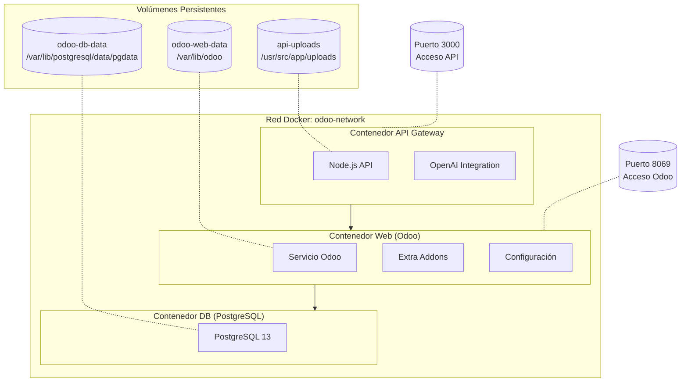

# Dockerización



Vamos a analizar cada componente:

## 1. **Dockerfile (Configuración de Odoo)**:
```dockerfile
FROM odoo:18.0  # Imagen base de Odoo versión 18
USER root       # Cambiamos a usuario root para instalaciones

# Instalación de dependencias
RUN apt-get update && apt-get install -y \
    python3-pip \
    && rm -rf /var/lib/apt/lists/*

# Configuración de directorios y permisos
RUN mkdir -p /mnt/extra-addons && chown -R odoo:odoo /mnt/extra-addons

# Copia de archivos
COPY ./odoo.conf /etc/odoo/
COPY --chown=odoo:odoo ./extra_addons /mnt/extra-addons

USER odoo  # Volvemos al usuario odoo por seguridad
EXPOSE 8069 8071 8072  # Exponemos puertos necesarios
```

## 2. **Docker Compose (Orquestación de Servicios)**:

### A. **Servicio Web (Odoo)**:
```yaml
web:
    build:
      context: .
      dockerfile: Dockerfile
    depends_on:
      - db  # Espera a que la base de datos esté lista
    ports:
      - "8069:8069"  # Puerto expuesto al host
    volumes:
      - odoo-web-data:/var/lib/odoo  # Datos persistentes de Odoo
      - ./odoo.conf:/etc/odoo/odoo.conf  # Configuración
      - ./extra_addons:/mnt/extra-addons  # Módulos personalizados
```

### B. **Servicio DB (PostgreSQL)**:
```yaml
db:
    image: postgres:13
    environment:
      - POSTGRES_DB=postgres
      - POSTGRES_USER=odoo
      - POSTGRES_PASSWORD=odoo
      - PGDATA=/var/lib/postgresql/data/pgdata
    volumes:
      - odoo-db-data:/var/lib/postgresql/data/pgdata  # Datos persistentes de PostgreSQL
```

### C. **Servicio API Gateway**:
```yaml
api-gateway:
    image: runinbk/odoo-mobile-gateway:latest
    ports:
      - "3000:3000"
    volumes:
      - api-uploads:/usr/src/app/uploads  # Almacenamiento de archivos subidos
    environment:
      - ODOO_URL=http://web:8069  # Conexión interna con Odoo
```

## 3. **Volúmenes**:
```yaml
volumes:
  odoo-web-data:    # Almacena archivos y datos de Odoo
  odoo-db-data:     # Almacena datos de PostgreSQL
  api-uploads:      # Almacena archivos subidos a través de la API
```
- Los volúmenes son persistentes y sobreviven reinicios de contenedores
- Mantienen los datos seguros y accesibles
- Permiten backups más fáciles

## 4. **Red Docker**:
```yaml
networks:
  odoo-network:
    driver: bridge  # Red puente para comunicación entre contenedores
```
- Permite comunicación segura entre contenedores
- Aísla los servicios del host y otras redes
- Los contenedores se pueden comunicar por nombre de servicio

Si quieres profundizar en las **Redes Docker aplicadas a este caso** ingresa al siguiente documento -> [**Redes Docker**](Tipos-de-Redes-en-Docker.md).

## 5. **Puntos importantes**:
- Los servicios están interconectados pero aislados
- Cada servicio tiene su propio propósito y responsabilidad
- Los volúmenes garantizan la persistencia de datos
- La red bridge proporciona aislamiento y comunicación segura
- Las variables de entorno configuran los servicios
- Los puertos expuestos permiten acceso desde el exterior

# Otros temas a profundizar

- [**Redes Docker**](Tipos-de-Redes-en-Docker.md) -> Tipos de redes en Docker.
- [**Volumenes Docker**](Tipos-de-Volumenes-en-Docker.md) -> Tipos de Volumenes en Docker.
- [**Imagenes Docker**](Creación-y-Gestión-de-Imágenes-Docker.md) -> Creación y Gestión de Imágenes Docker
