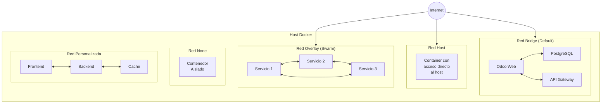

# Tipos de Redes en Docker



## 1. **Red Bridge (Predeterminada)**
```yaml
# Ejemplo de nuestro docker-compose.yml
networks:
  odoo-network:
    driver: bridge
```
- Es el tipo de red predeterminado
- Crea un puente virtual en el host
- Los contenedores pueden comunicarse entre sí
- Proporciona aislamiento del host
- **Casos de uso**:
  - Aplicaciones web con base de datos
  - Microservicios que necesitan comunicarse
  - Desarrollo local

## 2. **Red Host**
```yaml
# Ejemplo de contenedor con red host
version: '3'
services:
  nginx:
    image: nginx
    network_mode: "host"
```
- El contenedor usa la red del host directamente
- No hay aislamiento de red
- Mejor rendimiento
- **Casos de uso**:
  - Aplicaciones que necesitan máximo rendimiento
  - Monitoreo de red
  - Debugging

## 3. **Red Overlay**
```yaml
# Ejemplo de red overlay para Docker Swarm
networks:
  app-network:
    driver: overlay
    attachable: true
    driver_opts:
      encrypted: "true"
```
- Para comunicación entre nodos de Docker Swarm
- Permite escalado distribuido
- Soporta encriptación
- **Casos de uso**:
  - Clusters de producción
  - Aplicaciones distribuidas
  - Microservicios en múltiples hosts

## 4. **Red None**
```yaml
# Ejemplo de contenedor sin red
services:
  batch-job:
    image: my-batch-processor
    network_mode: "none"
```
- Contenedor completamente aislado
- Sin acceso a red
- Máxima seguridad
- **Casos de uso**:
  - Procesos batch
  - Trabajos de cálculo
  - Scripts de mantenimiento

## 5. **Redes Personalizadas**
```yaml
# Ejemplo de múltiples redes personalizadas
networks:
  frontend-network:
    driver: bridge
    internal: true
  backend-network:
    driver: bridge
    internal: true

services:
  web:
    networks:
      - frontend-network
  api:
    networks:
      - frontend-network
      - backend-network
  db:
    networks:
      - backend-network
```
- Control total sobre la topología
- Aislamiento por capas
- Mejor seguridad
- **Casos de uso**:
  - Separación de tráfico frontend/backend
  - Múltiples entornos en un host
  - Arquitecturas complejas

## Ejemplo Práctico con Odoo

Vamos a expandir nuestro caso de Odoo con redes más específicas:

```yaml
networks:
  frontend-network:
    driver: bridge
    # Para acceso desde Internet
  
  backend-network:
    driver: bridge
    internal: true  # Sin acceso a Internet
  
  api-network:
    driver: bridge
    # Para la API Gateway

services:
  web:
    networks:
      - frontend-network
      - backend-network
  
  db:
    networks:
      - backend-network  # Solo accesible internamente
  
  api-gateway:
    networks:
      - frontend-network
      - api-network
```

## Comandos Útiles para Gestión de Redes

```bash
# Listar redes
docker network ls

# Inspeccionar una red
docker network inspect odoo-network

# Crear una red personalizada
docker network create --driver bridge mi-red

# Conectar un contenedor a una red
docker network connect mi-red mi-contenedor

# Desconectar un contenedor de una red
docker network disconnect mi-red mi-contenedor
```

## Consideraciones de Seguridad

1. **Aislamiento**:
   - Usar redes internas para servicios sensibles
   - Limitar el acceso a Internet donde sea posible
   - Separar tráfico por tipos

2. **Comunicación**:
   - Usar DNS interno de Docker
   - Evitar exponer puertos innecesarios
   - Implementar reglas de firewall

3. **Monitoreo**:
   - Supervisar el tráfico de red
   - Registrar conexiones sospechosas
   - Implementar alertas
