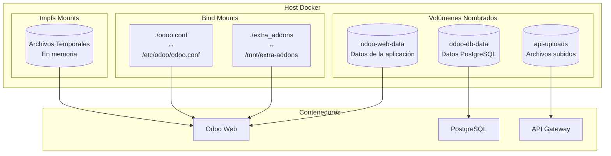

# Tipos de Volúmenes en Docker



## 1. **Volúmenes Nombrados (Named Volumes)**
```yaml
# En docker-compose.yml
volumes:
  odoo-web-data:    # Volumen para datos de Odoo
  odoo-db-data:     # Volumen para PostgreSQL
  api-uploads:      # Volumen para archivos subidos

services:
  web:
    volumes:
      - odoo-web-data:/var/lib/odoo
  db:
    volumes:
      - odoo-db-data:/var/lib/postgresql/data/pgdata
```
- Gestionados completamente por Docker
- Persistencia garantizada
- Fácil respaldo y migración
- **Casos de uso**:
  - Datos de bases de datos
  - Archivos de aplicación
  - Contenido generado por usuarios

## 2. **Bind Mounts**
```yaml
services:
  web:
    volumes:
      - ./odoo.conf:/etc/odoo/odoo.conf
      - ./extra_addons:/mnt/extra-addons
```
- Vinculan directamente con el sistema de archivos del host
- Útiles para desarrollo
- Permiten modificación en tiempo real
- **Casos de uso**:
  - Archivos de configuración
  - Código fuente en desarrollo
  - Compartir archivos con el host

## 3. **tmpfs Mounts**
```yaml
services:
  web:
    tmpfs:
      - /tmp
      - /run
```
- Almacenamiento temporal en memoria
- No persiste en disco
- Mayor rendimiento
- **Casos de uso**:
  - Archivos temporales
  - Caché
  - Datos sensibles temporales

## Ejemplos Prácticos de Uso

### 1. **Configuración para Desarrollo**
```yaml
services:
  web:
    volumes:
      # Volumen nombrado para datos persistentes
      - odoo-data:/var/lib/odoo
      # Bind mount para desarrollo activo
      - ./src:/usr/src/app
      # Bind mount para configuración
      - ./config:/etc/myapp
      # tmpfs para archivos temporales
      tmpfs:
        - /tmp
```

### 2. **Configuración para Producción**
```yaml
services:
  web:
    volumes:
      - app-data:/var/lib/app
      - static-files:/var/www/static
      - ssl-certs:/etc/ssl/private
```

### 3. **Backup y Restauración**
```bash
# Backup de un volumen
docker run --rm \
    -v odoo-db-data:/data \
    -v $(pwd):/backup \
    alpine tar czf /backup/db-backup.tar.gz /data

# Restauración de un volumen
docker run --rm \
    -v odoo-db-data:/data \
    -v $(pwd):/backup \
    alpine tar xzf /backup/db-backup.tar.gz
```

## Gestión de Volúmenes

### 1. **Comandos Básicos**
```bash
# Crear un volumen
docker volume create mi-volumen

# Listar volúmenes
docker volume ls

# Inspeccionar un volumen
docker volume inspect mi-volumen

# Eliminar un volumen
docker volume rm mi-volumen

# Eliminar volúmenes no utilizados
docker volume prune
```

### 2. **Estrategias de Respaldo**
```bash
# Backup automático con cron
0 2 * * * docker run --rm \
    -v odoo-db-data:/data \
    -v /backups:/backup \
    alpine tar czf /backup/db-$(date +%Y%m%d).tar.gz /data

# Rotación de backups
find /backups -name "db-*.tar.gz" -mtime +7 -delete
```

## Consideraciones Importantes

1. **Persistencia**:
- Los volúmenes nombrados persisten incluso después de eliminar contenedores
- Los bind mounts dependen del sistema de archivos del host
- tmpfs se pierde al reiniciar el contenedor

2. **Rendimiento**:
- Los volúmenes nombrados tienen mejor rendimiento que los bind mounts
- tmpfs ofrece el mejor rendimiento pero sin persistencia
- El rendimiento puede variar según el sistema de archivos del host

3. **Seguridad**:
- Los volúmenes pueden contener datos sensibles
- Importante establecer permisos adecuados
- Considerar encriptación para datos sensibles

4. **Buenas Prácticas**:
```yaml
volumes:
  # Usar nombres descriptivos
  app-data:
    driver: local
    driver_opts:
      type: none
      device: /path/to/data
      o: bind

services:
  app:
    volumes:
      # Usar rutas absolutas para bind mounts
      - ${PWD}/config:/config
      # Especificar permisos cuando sea necesario
      - type: volume
        source: data
        target: /data
        volume:
          nocopy: true
```
